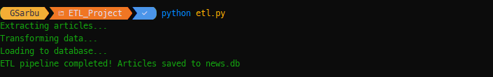
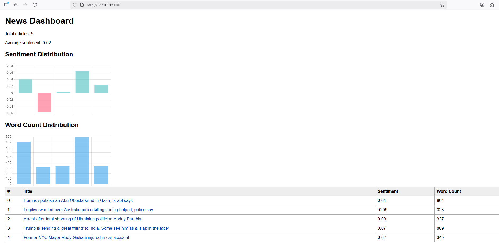

# News_ETL_Pipeline_Dashboard
News ETL Pipeline & Dashboard is a Python project that extracts news articles from BBC RSS feeds, processes and analyzes their content, and visualizes the data in an interactive web dashboard using Flask and Chart.js. 

Features:

-Extract latest news articles (title, link, content) from BBC RSS feed.

-Transform content: text cleaning, tokenization, stopword removal.

-Sentiment analysis using TextBlob.

-Load processed data into SQLite database.

-Interactive dashboard using Flask and Chart.js:

-List of articles with sentiment scores and word count.

-Sentiment distribution chart.

-Word count distribution chart.

Tech Stack:

-Python 3.8+

-ETL & NLP: pandas, nltk, textblob

-Web Dashboard: Flask, Chart.js

-Database: SQLite

-Web scraping: requests, BeautifulSoup4

Installation: pip install -r requirements.txt

Download NLTK resources (one-time):

import nltk

nltk.download("punkt")

nltk.download("stopwords")

Usage:

Run ETL pipeline: python etl.py

Run dashboard: cd dashboard

python app.py

Open browser: http://127.0.0.1:5000

Screenshot:

